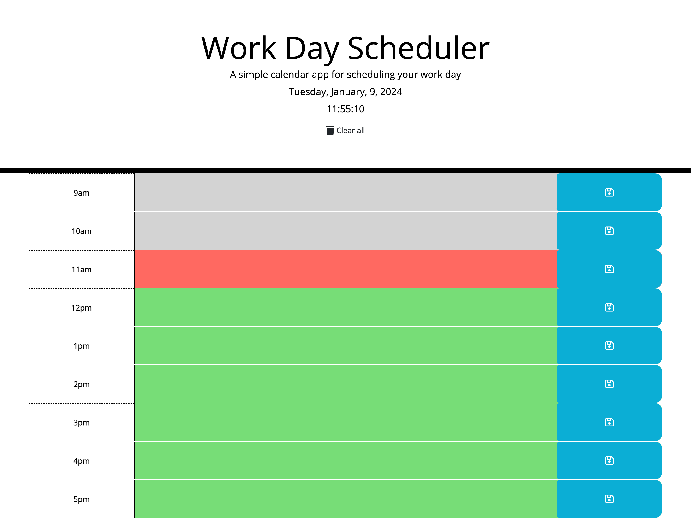
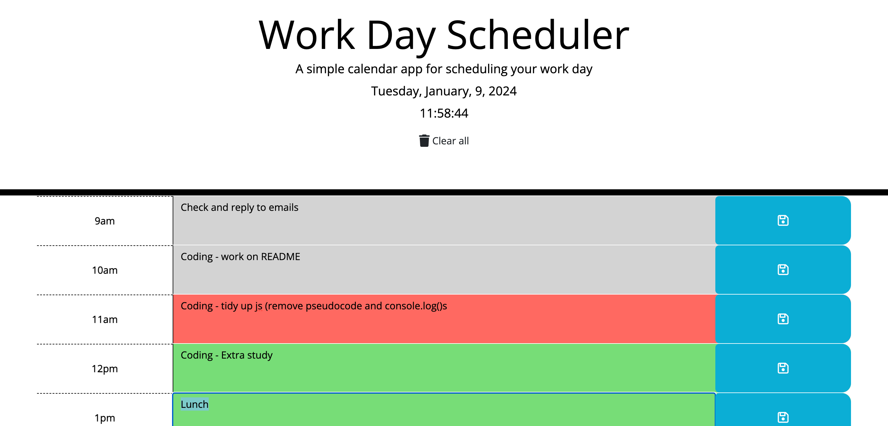
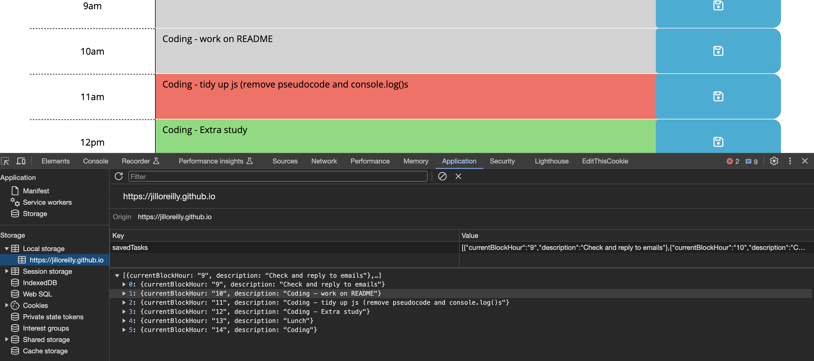
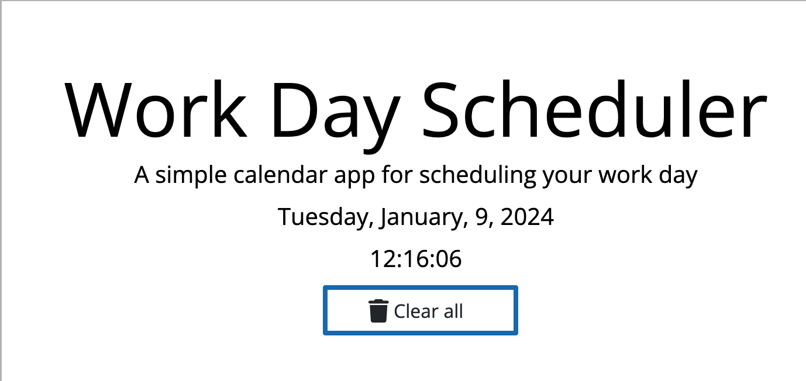

# Work Day Scheduler

Challenge 7 - A simple calendar application that allows a user to save events for each hour of the day.

## Description

This calendar application showcases the jQuery and JavaScript skills I have gained from Module 7 (Third-Party APIs) of the Front-end Web Development Bootcamp. 

This calendar application will run in the browser and feature dynamically updated HTML and CSS powered by jQuery and DayJs.

## Usage

1. The **Work Day Scheduler** application can be accessed online on Github pages: [https://jilloreilly.github.io/work-day-scheduler/](https://jilloreilly.github.io/work-day-scheduler/)

2. The current date and time is displayed at the top of the page

3. The work day time blocks (9am - 5pm) is colour coded into past (grey), present (red) and future (green). The updateHour() function is set to run every hour.

3. The user can click on a timeblock and enter a task description.

4. The task is saved to local storage when the 'Save' icon for that timeblock is clicked.

4. If the page is refreshed the saved tasks will be reloaded to the page

5. The user can click on 'Clear all' to remove all saved tasks from the page and from local storage.

## Credits

Thank you to the following:

- jQuery:
  - [API](https://api.jquery.com/)
  - [.each](https://api.jquery.com/each/)

- MDN web docs for:
  - [JSON.stringify()](https://developer.mozilla.org/en-US/docs/Web/JavaScript/Reference/Global_Objects/JSON/stringify)
  - [JSON.parse()](https://developer.mozilla.org/en-US/docs/Web/JavaScript/Reference/Global_Objects/JSON/parse) 

- [DayJs documentation for formatting time](https://day.js.org/docs/en/display/format)

- Pod 2 TA **Christopher Kratz** for running us through the start of the challenge.

- My tutor **Cody Junier** for helping me resolve an issue of retrieving saved data from local storage and printing to the page on page refresh.

## License

MIT License

Copyright (c) 2023 Jill O'Reilly

Permission is hereby granted, free of charge, to any person obtaining a copy
of this software and associated documentation files (the "Software"), to deal
in the Software without restriction, including without limitation the rights
to use, copy, modify, merge, publish, distribute, sublicense, and/or sell
copies of the Software, and to permit persons to whom the Software is
furnished to do so, subject to the following conditions:

The above copyright notice and this permission notice shall be included in all
copies or substantial portions of the Software.

THE SOFTWARE IS PROVIDED "AS IS", WITHOUT WARRANTY OF ANY KIND, EXPRESS OR
IMPLIED, INCLUDING BUT NOT LIMITED TO THE WARRANTIES OF MERCHANTABILITY,
FITNESS FOR A PARTICULAR PURPOSE AND NONINFRINGEMENT. IN NO EVENT SHALL THE
AUTHORS OR COPYRIGHT HOLDERS BE LIABLE FOR ANY CLAIM, DAMAGES OR OTHER
LIABILITY, WHETHER IN AN ACTION OF CONTRACT, TORT OR OTHERWISE, ARISING FROM,
OUT OF OR IN CONNECTION WITH THE SOFTWARE OR THE USE OR OTHER DEALINGS IN THE
SOFTWARE.

## Technologies Used

